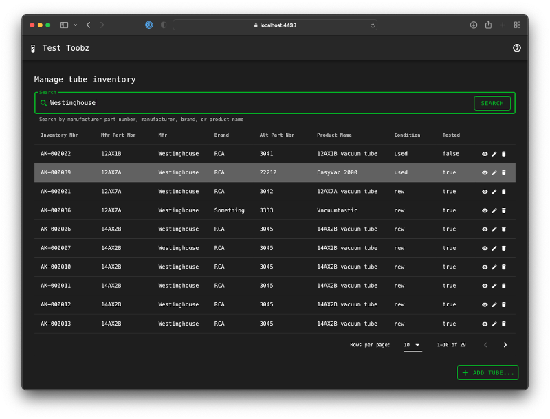
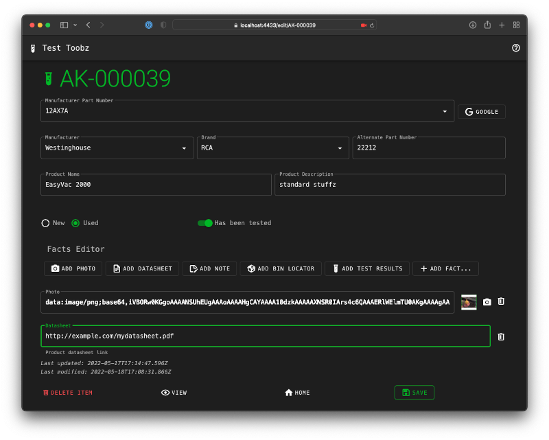
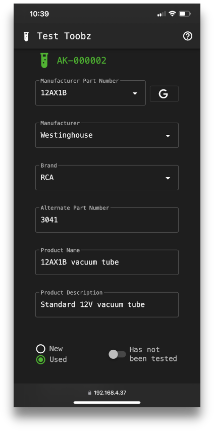

# toobz-web


Web-based GUI for an inventory management system used to track loads of old vacuum tubes.

A friend of mine recently bought out a stash of old vacuum tubes at the estate sale of a local electronics shop owner. This application is designed to help him fight his natural tendency to let them all pile up for decades in an unsorted mess in the same way that the shop owner had done. Not because such clutter is necessarily a bad thing, but because it takes up space in his apartment that he could otherwise be dedicating to the accumulation and investigation of more fun toys.

Of course, it could all be probably be handled with a big spreadsheet, too. But where's the fun in that?

## Features

* Mobile friendly
* Flexible search
* Global keyboard shortcuts
* Store arbitrary facts about each inventory item, including web links
* Autocomplete common fields for rapid data entry
* Automatically assign unique inventory number to each item
* Store test status and results for each tube
* Built-in Google search to quickly look up photos or datasheets and such
* Support for photos (links to images on the web or take pictures from the camera on your device)
* Automatically generate QR codes for each inventory item
* Printable labels

## Screenshots





## Dependencies

* A running instance of `toobz-api` that can be accessed from the browser

## Configuration

The location of the `toobz-api` service needs to be accessible from the browser and set in `src/config.js`

```javascript
export default {
    apiBase: "https://your.service.here:port"
}
```

## Installing

```bash
yarn install
```

## Development

The following transpiles and runs under a local web-server with hot-reload capabilitity for development.

```bash
yarn serve
```

The dev server configuration is located in `src/vue.config.js` and is currently configured to serve as HTTPS with a particular pair of certificate files. You can, of course, change these settings, including setting `https: false` if you wish.

However, note that

* Browsers will silently block the camera access functionality *without* HTTPS *unless* it is running under localhost. Everything else should continue to work fine, however.
* If your web server *is* running under HTTPS, the API will *also* need to be available (and configured to be accessed via, see above) HTTPS as well, or else the AJAX calls will be blocked and the app will not work at all.

For further details on configuring SSL certificates for dev, see [SSL Certificates](sslcert/README.md).

## Production

The following transpiles and minifies for production. 

```bash
# using yarn
yarn build 
# or, using the Makefile wrapper
make build
```

The results will be written to the `dist` folder and can be served by any static web server.
Take care to serve over HTTPS (see the limitations above otherwise).

## Containers

A basic `Dockerfile` is provided for you to use if you like. Don't if you don't.

The container uses Nginx to serve the statically generated production build files. It assumes HTTPS, and provides a suitable simple configuration
file at `docker/default.conf` which `start-container.sh` will mount to the correct place.

So a typical workflow might look like

```bash
make build
cp dotenv .env-container # and edit as needed
./start-container.sh
```

## Technologies used

* [Vue.js](https://vuejs.org) because it's about the only frontend web framework that doesn't make me want to kill myself
* [Vuetify](https://vuetifyjs.com) because John has done a *really* nice job with this
* [Axios](https://axios-http.com/) because I'm lazy and it's there
* [easy-vue-camera](https://github.com/farhadnowzari/easy-vue-camera#readme) because it makes interacting with the device camera painless
* [vue-qr](https://github.com/Binaryify/vue-qr) because QR code generation
* [Nginx](https://nginx.com) because that's how I roll
* [Docker](https://docker.com) because containers are convenient, and Docker is, well, adequate

## License

MIT
